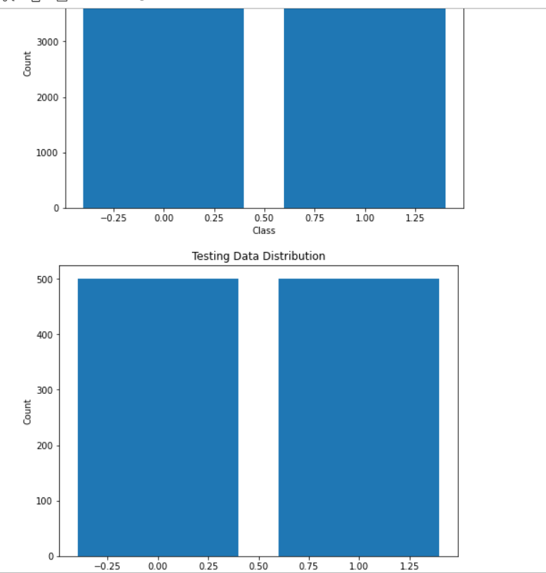

# Melonama cancer diagonstices


## about
Project is about diagonstices of melanoma cancer (skin cancer) to benign/malignent ,usingbig image dataset 

## preprocess and visualization
- visualizations for screening data diversity ,and checking  data are same size benign/malignent


-loading data using `getData(path)`
which read all images and append to train ,test data ,and simealtinously append to x ,y
```
def getData(path):
    X_train,y_train,X_test,y_test,=[],[],[],[]
    for data_name in os.listdir(path):
            for typ in os.listdir(path+data_name):
                for img in sorted(os.listdir(path+data_name+'/'+typ),key=natural_sort_key):
                    with Image.open(path+data_name+'/'+typ+'/'+img) as image:
                        if (data_name=='train'):
                            X_train.append(np.array(image))
                            y_train.append(1 if typ=='malignant' else 0)
                        else:
                            X_test.append(np.array(image))
                            y_test.append(1 if typ=='malignant' else 0) 
```
note the function use `natural_sort_key`  uses regex to open images in sorted  in name as folder ,this sort names as images name in main data

-preprocess :to help computation images converted to grayscale ,also normalized ,resized to be same size
-just preprocess was very computation internsive so we used **mini-batch approach** ,and  **saved proceed files**

-mini-batch processing (of X_train for ex):
```
batch_size = 100
num_images = len(X_train)
processed_X_train = []
for start in range(0, num_images, batch_size):
    end = min(start + batch_size, num_images)
    batch = X_train[start:end]
    batch_gray = [cv2.cvtColor(image_array, cv2.COLOR_BGR2GRAY) for image_array in batch]
    batch_processed = [cv2.resize(scaleImage(image), (200, 300)) for image in batch_gray]
    processed_X_train.extend(batch_processed)

processed_X_train = np.array(processed_X_train)

```

-saved proceed files are the same structure as original so no need to do any stranges (except names  are became simple)

-proceed data are in link below 

## try to more compress
-generally last preprocess has reduced images size but those tries don't get very effective result her
-color cluster using KNN ,we tested in just part of images and compared size on disk ,that unfortantely not very decreased ,may be due to limited colors in this images ,as in skin
-PCA 


## models 
-we trained 2 models to classify cancers
-to get better results images are shuffled before training 
```
import random
data = list(zip(X_train, y_train))
random.shuffle(data)
X_train, y_train = zip(*data)
X_train=np.array(X_train)
y_train=np.array(y_train)
del(data)
```
-NN model but in bad accuracy 50%
-CNN model ,in accuracy 83%
-NN are trained using batches `batch_size = 10`
-also models to help computation ,models saved in h5 files (in link below)

-finally stramlit website of using model
## problems 
-not very high accuracy for this sensitive medical case
-grid search not used
-Models are very slow to train
-stramlit has some errors


## team
Taha fawzy,Mostafa hussien ,Andrew Zakaria fawzy,
Omar Ahmed taha,Ahmed Ibrahim hassan ,
Mohab emad ,Ahmed ali ,Adham abdelsalam mohammed 
Omar tarek Mahmoud 

### project data https://www.kaggle.com/datasets/hasnainjaved/melanoma-skin-cancer-dataset-of-10000-images

### Project compiled models and proceed images https://drive.google.com/drive/folders/1NmZh2jItJPY222FpY5UTqaGkjhk1nWWO?usp=sharing

